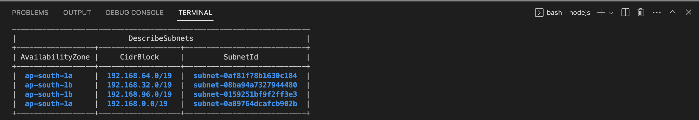

## Pre-requisites
- helm
- aws cli
- kubectl
- eksctl

- ### Create EKS cluster on AWS
  
    ```
     eksctl create cluster -f ./aws/cluster.yaml
    ```
- ### After creating EKS cluster
    After the cluster is created run the below command which will perform below tasks
     - Setup the EFS CSI driver for file system storage
     - Create an ECR repository for storing Docker images
     - Create a Helm application for deploying the application
     - Build and push the Docker image to the ECR repository
     - Create EFS on aws for Elastisearch, Prometheus Server and Grafana
       
    But before running below command please update the .env.local which consist of two variables `APPLICATION_NAME` and `TRANSPORTER_EXPORTER_URL`. Here APPLICATION_NAME is the name which will be displayed in Jaeger UI and TRANSPORTER_EXPORTER_URL is the endpoint of otel collector whose value will be 
    `otelName` + "-collector.default.svc.cluster.local:4318/v1/traces". Here `otelName` is the value provided in values.yaml for the ws-observability-chart. 

    After executing the command, a table will be displayed on the command line interface as shown in the image below from which note 2 availability zone and the respective subnet for the EKS cluster node as well as note the fileSystemId id's for elasticsearch , prometheus and grafna
      

    ```
     ./scripts/setup-efs-csi-driver.sh --clusterName=xyz --regionCode=abc --accountId=qwerty --applicationName=eks --env=qa 
    ```  

- ### Create mount target and access point for Elastisearch, Prometheus Server and Grafana    
  
    ```
     ./scripts/create-mount-target.sh --clusterName=XYZ --elasticsearchFId=XYZ --prometheusServerFId=XYZ --grafanaFId=XYZ --subnet1=XYZ --subnet2=XYZ --regionCode=XYZ 
    ```  

- ### Install ws-observability-chart
    Before proceeding with the installation of the ws-observability-chart, it would be helpful to review the values.yaml file to identify any parameters that may need to be modified based on the specific requirements of the installation.The values are given below 
     - `fluent-bit.eck-kibana.eck-elasticsearch.fullnameOverride` paramter in values.yaml is used decide elasticsearch pod name.
     -  `elascticsearchName` it should equal to value of `fluent-bit.eck-kibana.eck-elasticsearch.fullnameOverride`.
     -  `jaegerName` it is used to decide jaeger collector and query pod name
     -  `jaegerEndpoint` parameter in values.yaml is used as an exporter endpoint for the OpenTelemetry collector. The value of the   `jaegerEndpoint` parameter is determined by combining the `jaegerName` parameter with the string "-collector.default:14250".
     -  `otelName` paramter is used to decide otel collector name
     -  `fluent-bit.es_host_logging` paramter helps fluent-bit to find elasticsearch node. The value of the `fluent-bit.es_host_logging` parameter is decided by combining `elasticsearchName` parameter value with the string "-es-http.default"
     -  `grafana.datasources.datasources.yaml.datasources.url` is a paramter in the values.yaml whose value is the "http://${helm-chart-name}-prometheus-server.default.svc.cluster.local".So, here in the url the helm-chart-name value is the name value with which you are going to install ws-observability chart. For example if you install using helm install eks ./ws-observability/ws-observability-chart -f ./values.yaml, here name of the chart is eks whcih you can replace with any name and therfore the value of url will become  "http://eks-prometheus-server.default.svc.cluster.local"

    The above values are used to configure  pod name and the endpoints for them.And for achieveing persistent volume we need to specify fileSystemId and accessPointId for the paramters specified below
    - The `fluent-bit.eck-kibana.eck-elasticsearch.aws.efs.filesystemId` parameter is used to specify the fileSystemId of the Elastic File System (EFS).This parameter is present in the values.yaml file.
    - The `fluent-bit.eck-kibana.eck-elasticsearch.aws.efs.accessPointId` parameter is used to specify the accessPointId of the Elastic File System (EFS).This parameter is present in the values.yaml file.
    - The `prometheus.aws.efs.fileSystemId` parameter is used to specify the fileSystemId of the Elastic File System (EFS).This parameter is present in the values.yaml file.
    - The `prometheus.aws.efs.accessPointId` parameter is used to specify the accessPointId of the Elastic File System (EFS).This parameter is present in the values.yaml file.
    - The `grafana.aws.efs.fileSystemId` parameter is used to specify the fileSystemId of the Elastic File System (EFS).This parameter is present in the values.yaml file.
    - The `grafana.aws.efs.accessPointId` parameter is used to specify the accessPointId of the Elastic File System (EFS).This parameter is present in the values.yaml file.

    Once the necessary modifications have been made to the values.yaml file based on the specific requirements of the deployment, proceed with the installation of the chart.

    ```
     helm install eks ./ws-observability/ws-observability-chart -f ./values.yaml
    ```
- ### Install the backend on the eks cluster

     ```
     ./scripts/helm-upgrade.sh --region=XYZ --applicationName=XYZ --env=qa --awsAccountId=XYZ
     ```            
  